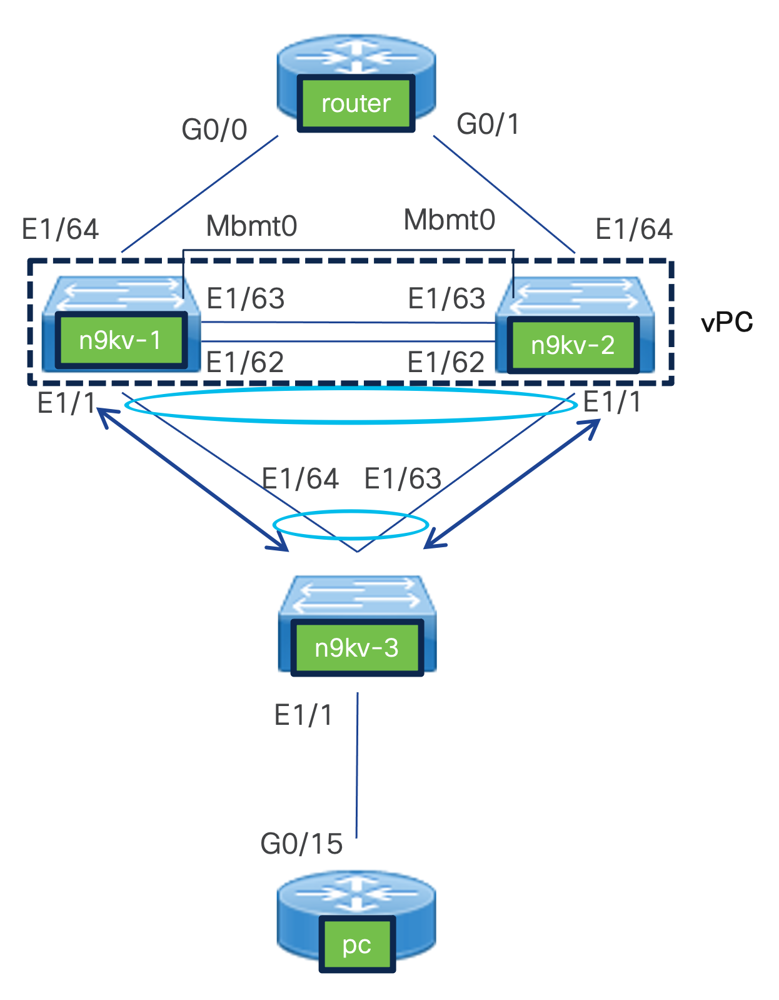

# vpc-test-pyats

vpc-test-pyats は Cisco Modeling Labs (CML) 上の
仮想機器 Nexus9000v を使い構築したvPC環境をpyATSを使い検証するスクリプトです。
本環境で試したCMLのバージョンは2.7.0です。

## フォルダ構成
- Readme.md
  - フォルダの概要や実施方法を示したものです
- get-testbed.py
  - CML上のLabのTestbed情報を取得するスクリプトです
  - 大まかにはChatGPTが作成、細かい部分は手動で修正
- vpc-test.py
  - testbed.yamlで示されたネットワーク機器に対し、インタフェースのshutdown, no shutdownやPingの実施をし、検証を自動化するスクリプトです
  - ChatGPT作です
- Programmability(vPC).yaml
  - 本検証で使用したラボ環境のYAMLファイルです。CMLにインポートすることで初期構築の時間を短縮できます。
  - IPアドレスや認証周りの情報はご自分で入力してください。

## 想定環境


## 検証内容
1. pc から routerに対して ping を実施
2. n9kv-3のEthernet1/64をDownし、pc から router に対して ping を実施 
3. n9kv-3のEthernet1/64をUp、Ethernet1/63をDownし、pc から router に対して ping を実施 
4. n9kv-3のEthernet1/64をDown、Ethernet1/63をDownし、pc から router に対して ping を実施
5. n9kv-3のEthernet1/64をUp、Ethernet1/63をUpし、pc から router に対して ping を実施 

## 実行順序
1. CMLでLabを準備
   1. ```Programmability(vPC).yaml``` をインポートし、各機器に以下の初期設定を入力 (Nexut9000vのusername/passwordの初期設定はcisco/ciscoです)
      1. n9kv-1
      ```
      hostname n9kv-1
      feature lacp
      feature vpc

      no spanning-tree vlan 1-3967
      vlan 1,100-199

      interface mgmt0
        ip address 172.16.100.100/24

      vpc domain 100
        role priority 1000
        peer-keepalive destination 172.16.100.101
        auto-recovery
        peer-switch

      interface Ethernet1/62-63
        channel-group 4096 mode active

      interface port-channel4096
        switchport mode trunk
        vpc peer-link

      interface Ethernet1/1
        channel-group 1 mode active

      interface port-channel1
        switchport mode trunk
        switchport trunk allowed vlan 100-199
        vpc 1

      interface Ethernet1/64
        switchport mode access
        switchport access vlan 100
      copy running-config startup-config
      ```
      2. n9kv-2
      ```
      hostname n9kv-2
      feature lacp
      feature vpc
      
      no spanning-tree vlan 1-3967
      vlan 1,100-199
      
      interface mgmt0
        ip address 172.16.100.101/24
      
      vpc domain 100
        role priority 2000
        peer-keepalive destination 172.16.100.100
        auto-recovery
        peer-switch
      
      interface Ethernet1/62-63
        channel-group 4096 mode active
      
      interface port-channel4096
        switchport mode trunk
        vpc peer-link
      
      interface Ethernet1/1
        channel-group 1 mode active
      
      interface port-channel1
        switchport mode trunk
        switchport trunk allowed vlan 100-199
        vpc 1
      
      interface Ethernet1/64
        switchport mode access
        switchport access vlan 100
      copy running-config startup-config
      ```
      3. n9kv-3
      ```
      hostname n9kv-3
      feature lacp
      no spanning-tree vlan 1-3967
      vlan 1,100-199
      interface Ethernet 1/63-64
        channel-group 4096 mode active
      
      interface port-channel4096
        switchport mode trunk
        switchport trunk allowed vlan 100-199
      
      interface Ethernet 1/1
        switchport mode access
        switchport access vlan 100
      copy running-config startup-config
      ```
      4. router
      ```
      hostname router
      bridge irb
      bridge 1 protocol ieee
      bridge 1 route ip
      interface GigabitEthernet 0/0
        bridge-group 1
        no shutdown
      interface GigabitEthernet 0/1
        bridge-group 1
        no shutdown
      interface BVI 1
        ip address 10.0.0.1 255.255.255.0
      do write
      ```
      5. pc
      ```
      hostname pc
      interface GigabitEthernet 0/15
        ip address 10.0.0.100 255.255.255.0
        no shutdown
      ```
   2. Catalyst9000vを使う場合は、Login password は ```username {username} secret {password}``` で入力してください。
2. pyATSを実行するために必要なtestbed.yamlを取得する
   1. 取得方法は2種類
      1. CMLのGUIから取得
      2. APIを使い取得 (本環境でのAPIによるtestbed.yaml取得スクリプトは ```get-testbed.yaml``` で保存)
         1. ```get-testbed.yaml``` を使う場合は {change-this} 部分を変更してください
3. ChatGPT にPythonスクリプト作成を依頼
   1. 本作者の環境でChatGPTに作成してもらったPythonファイルは ```vpc-test.py``` で保存
4. ChatGPTに作成してもらったPythonファイルを実行するために必要なパッケージをインストール
   1. 本作者の場合：Python3, pip3, pyats, genie をインストール
      1. pyatsとgenieは ```pip3 install 'pyats[full]'``` でまとめてインストール可能
   2. これらのインストール方法はせっかくなのでChatGPTに聞いたりネットで調べてみましょう
   3. Pythonを使う場合は仮想環境を使うとパッケージの管理が容易になります
5. ChatGPTに作成してもらったPythonファイルを実行 (```python3 vpc-test.py```)
   1. {change-this} と書かれた部分を変更してください

## ChatGPT プロンプト
### testbed.yamlを取得
```
あなたはCisco Modeling Labs(CML)とPythonのスペシャリストです。 CML ServerからLabのリストを取得し、取得した各LabのIDからLabの詳細情報を取得し、"Programmability(vPC)"というタイトルのLab のpyATS Testbedを取得するPythonスクリプトを作成してください。 また、CML Serverの情報を以下に示します。
CML Server情報
URL: https://{change-this}, 
Username: {change-this}, 
Password: {change-this}
```

:::note warn
{change-this}の部分を環境に合わせて変更してください。
:::

### 検証を自動化するスクリプトを作成
```
あなたはこれからネットワークテストを実施します。 testbed.yamlで定義されたデバイスに対し、以下の順序でテストを進めてください。 
1. pc から 10.0.0.1 に対して ping を実施 
2. n9kv-3のEthernet1/64をDownし、pc から 10.0.0.1 に対して ping を実施
3. n9kv-3のEthernet1/64をUp、Ethernet1/63をDownし、pc から 10.0.0.1 に対して ping を実施
4. n9kv-3のEthernet1/64をDown、Ethernet1/63をDownし、pc から 10.0.0.1 に対して ping を実施
5. n9kv-3のEthernet1/64をUp、Ethernet1/63をUpし、pc から 10.0.0.1 に対して ping を実施

また各順序の実施結果を1つのファイルに出力し、resultというディレクトリに保存してください。resultディレクトリはなければ作成してください。
ファイルには以下の情報を含んでください。
1. n9kv-3のEthernet1/64とEthernet1/63のInterface status
2. テスト結果
```